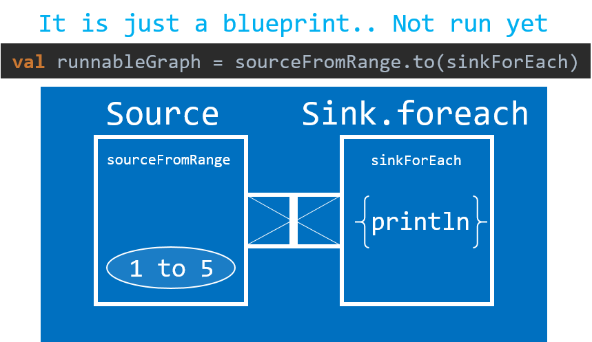

# `Sink` introduction

## Summary of this article 

* `Source`'s `runForeach` method is equivalent to `runWith()` + `Sink.foreach`
* A `RunnableGraph`, which is a blueprint to `run()`

## Source code in this artidle

```
implicit val system = ActorSystem()
implicit val materializer = ActorMaterializer()

val sourceFromRange = Source(1 to 5)
val sinkForEach = Sink.foreach{ i: Int => println(i) } //[Int] is needed
//use runWith, instead of runForeach
sourceFromRange.runWith(sinkForEach)

val r = sourceFromRange.to(sinkForEach)
r.run()

//beginner tips: {} == (), nicer syntax for passing closure

Thread.sleep(1000)
system.terminate()
```

## `Sink` introduced

```
val sourceFromSingle = Source.single(1)
sourceFromSingle runForeach{ i => println(i) }
```

In the previous article you saw code as above.


Inside `runForeach()`, the above code created `Sink` (i.e.) The above code is equivalent to the following:

```
val sourceFromRange = Source(1 to 5)
val sinkForEach = Sink.foreach{ i: Int => println(i) } //[Int] is needed
//use runWith() and Sink explicitly, instead of runForeach
sourceFromRange.runWith(sinkForEach)
```

This creates `Sink`, as well as `Source`, and run the stream with `runWith()` method. 


Akka Stream typically starts from `Source` and ends in `Sink`.

## `RunnableGraph` (Akka Stream's blueprint) and `run`ning the stream

```
val sourceFromRange = Source(1 to 5)
val sinkForEach = Sink.foreach{ i: Int => println(i) } //[Int] is needed
val runnableGraph = sourceFromRange.to(sinkForEach)
```



```
runnableGraph.run()
```


<div style="width: 100%; text-align: center;">
  <iframe src="https://vine.co/v/5FT9OpYEDzO/embed/simple" width="300" height="300" frameborder="0"></iframe><script src="https://platform.vine.co/static/scripts/embed.js"></script>
</div>
