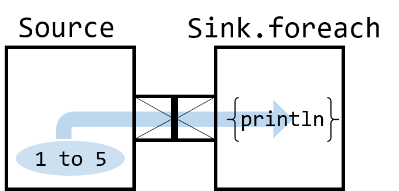
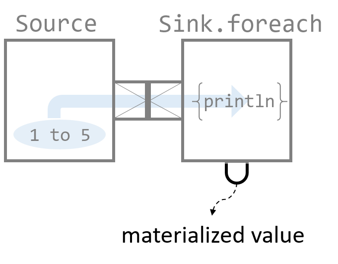
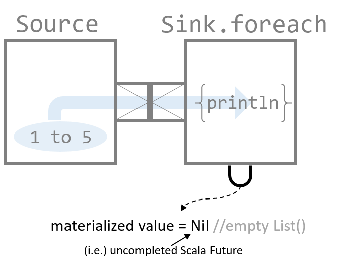

# Materialization and other `Sink` examples

## Summary of this article 

* "Materialization" to retrieve "outcome" of a stream, from outside of the stream

## Source code in this article

```
implicit val system = ActorSystem()
implicit val materializer = ActorMaterializer()

val sourceFromRange = Source(1 to 5)
val sinkForEach = Sink.foreach{ i: Int => println(i) } //[Int] is needed

//print List() = Nil
val materialized = sourceFromRange.runWith(sinkForEach)
println(s"materialized value = ${materialized}")

Thread.sleep(50)
println(s"materialized value = ${materialized}")

val m1 = sourceFromRange runWith( Sink.head )
Thread.sleep(50)
println(m1)

val m2 = sourceFromRange runWith( Sink.headOption )
Thread.sleep(50)
println(m2)

val m3 = sourceFromRange runWith( Sink.last )
Thread.sleep(50)
println(m3)

val m4 = sourceFromRange runWith( Sink.lastOption )
Thread.sleep(50)
println(m4)

val m5 = sourceFromRange runWith( Sink.seq )
Thread.sleep(50)
println(m5)

val m6 = sourceFromRange runWith( Sink.ignore )
Thread.sleep(50)
println(m6)

Thread.sleep(1000)
system.terminate()
```

## "Materialized" value

In the [previous article](index3.html#sink-introduced) you saw code as follows:

``` 
val sourceFromRange = Source(1 to 5)
val sinkForEach = Sink.foreach{ i: Int => println(i) } //[Int] is needed
//use runWith() and Sink explicitly, instead of runForeach
sourceFromRange.runWith(sinkForEach)
```



The last line of the above code 

```
sourceFromRange.runWith(sinkForEach)
```

runs the stream. 

The `runWith()` method actually **returns a value**, so let's bind it to a `val` and name it as `materialized`.

```
val materialized = sourceFromRange.runWith(sinkForEach)
println(s"materialized value = ${materialized}")
```




This will print out,

```
materialized value = List() //The result could vary dependent on environment
```

Why is it `List()`? We will [explain the meaning of this bit later](#why-list-was-returned)

Interestingly, after `Thread.sleep(50)`,    

```
Thread.sleep(50)
println(s"materialized value = ${materialized}")
```
 
the same `materialized` will result in,

```
materialized value = Success(Done)
```

because the stream must have been completed.

### Why `List()` was returned?

**Short answer**: because it is the value of uncompleted `Future` in Scala.

The result could vary dependent on your environment,  
but if you get `List()` as the materialized value (this could be different dependent on your environment), 

```
val materialized = sourceFromRange.runWith(sinkForEach) 
```

the actual type of `materialized` is:

```
materialized: scala.concurrent.Future[akka.Done] = List()
```

So it is a Scala `Future` ([see the Scala `Future` article](http://docs.scala-lang.org/overviews/core/futures)).

To see why this happens, look at the below code executed in Scala REPL:

```
import akka.actor.ActorSystem
implicit val system = ActorSystem()
implicit val ec = system.dispatcher
Future(1)
```

you will get the result of `Future(1)`:

```
res1: scala.concurrent.Future[Int] = List()
```

Yes, it was `List()`, meaning the return of uncompleted Scala `Future` (again, dependent on your environment) is `List()`.

Note that Scala uncompleted `Future` returns `List()` even if the wrapped value is not a Scala collection. 
In fact, the wrapped value in `Future` was `1` in the above code.

`List()` is eventually from Scala `Promise`, the other side of Scala `Future` ([again, see the Scala `Future` article](http://docs.scala-lang.org/overviews/core/futures))

```
scala>  Promise[Int]
res6: scala.concurrent.Promise[Int] = List()
```

If you look at the implementation of Scala `Promise` this `List()` is defined as `Nil`.
So the default value of uncompleted `Promise` (as well as uncompleted `Future`) is `Nil`, and its run-time value is evaluated as `List()`.

## Materialized values with different `Sink` kinds

As you saw above, an uncompleted stream has materialized value = `Nil`.



If `Sink` is `Sink.foreach`, then the materialized value is in type = `Future[akka.Done]`, 
so `Success(Done)` is the completed materialized value.


`akka.Done` is only an indication of the stream completion, but different `Sink` can give more info like from the materialized value below:

```
val m1 = sourceFromRange runWith( Sink.head )
Thread.sleep(50)
println(m1)
```

```
> Success(1)
```

<div style="width: 100%; text-align: center;">
  <iframe src="https://vine.co/v/5FtB5tx2dg7/embed/simple" width="300" height="300" frameborder="0"></iframe><script src="https://platform.vine.co/static/scripts/embed.js"></script>
</div>

```
val m2 = sourceFromRange runWith( Sink.headOption )
Thread.sleep(50)
println(m2)
```

```
> Success(Some(1))
```

Instead of getting the head value, you can get the last value like below:

```
val m3 = sourceFromRange runWith( Sink.last )
Thread.sleep(50)
println(m3)
```

```
> Success(5)
```

<div style="width: 100%; text-align: center;">
  <iframe src="https://vine.co/v/5FtBvOdH13B/embed/simple" width="300" height="300" frameborder="0"></iframe><script src="https://platform.vine.co/static/scripts/embed.js"></script>
</div>

```
val m4 = sourceFromRange runWith( Sink.lastOption )
Thread.sleep(50)
println(m4)
```

```
> Success(Some(5))
```

```
val m5 = sourceFromRange runWith( Sink.seq )
Thread.sleep(50)
println(m5)
```

```
> Success(Vector(1, 2, 3, 4, 5))
```


```
val m6 = sourceFromRange runWith( Sink.ignore )
Thread.sleep(50)
println(m6)
```

```
> Success(Done)
```

